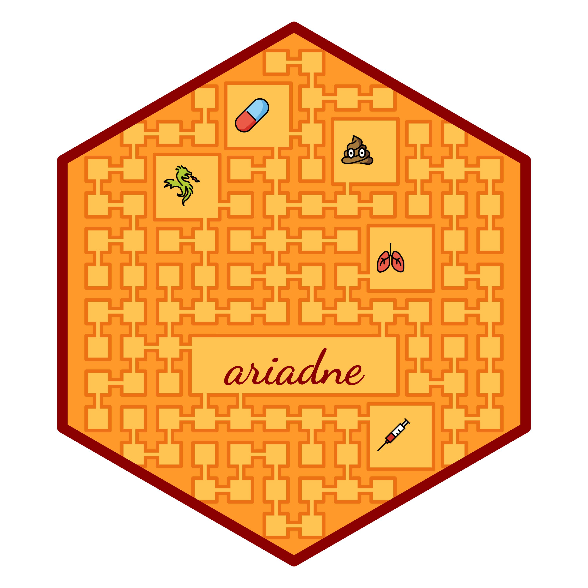

# ariadne: assembling relational information across the database network 

[](https://github.com/Minotau-R/ariadne/issues)
[](https://github.com/Minotau-R/ariadne/pulls)
[](https://github.com/Minotau-R/ariadne/actions)
[](https://codecov.io/gh/Minotau-R/ariadne)
[](https://www.codefactor.io/repository/github/minotau-r/ariadne)

ariadne is a multi-purpose R package that integrates relational knowledge from
various biological databases. It provides tools to navigate resource graphs,
find and visualise paths between features and link them across different omics
by leveraging the resource graph hosted in the companion package
[ariadne.db](https://github.com/Minotau-R/ariadne.db).

Example applications:

- explore relations across omics using curated knowledge, fetched automatically
  and efficiently using SPARQL and parquet
- stratify microbes by BugSig and Gut Metabolic modules for functional or
  microbe-set enrichment analysis
- converge features from different taxonomies (NCBI, SILVA, OTT, etc.)

# Usage

## Installation instructions

In the future, we intend to submit ariadne to Bioconductor. For now, the package
can be installed with:

```
remotes::install_github("Minotau-R/ariadne")
```

## Code of Conduct

Please note that the ariadne project is released with a
[Contributor Code of Conduct](https://bioconductor.org/about/code-of-conduct/).
By contributing to this project, you agree to abide by its terms. Contributions
are welcome in the form of feedback, issues and pull requests. You can find the
contributor guidelines of the miaverse
[here](https://github.com/microbiome/mia/blob/devel/CONTRIBUTING.md).

## Acknowledgements

ariadne results from the joint effort of the larger bioinformatics community. In
particular, this software is related to the following packages:

- [_MultiFactor_](https://github.com/Minotau-R/MultiFactor/)
- [_mia_](https://bioconductor.org/packages/release/bioc/html/mia.html)
